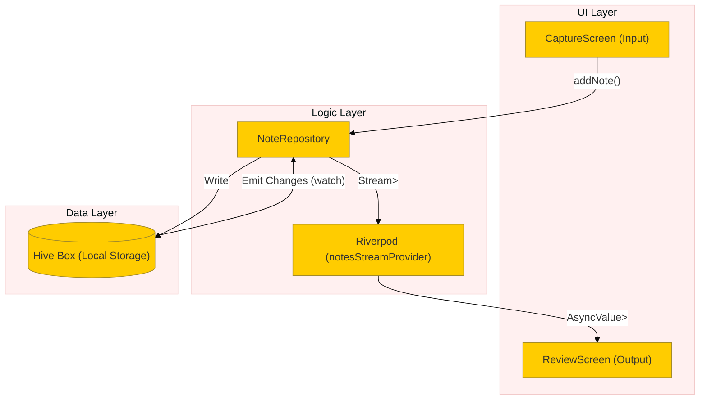
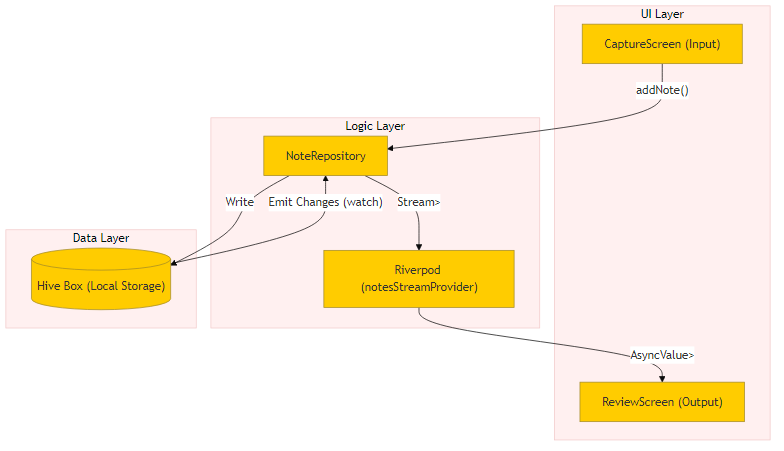
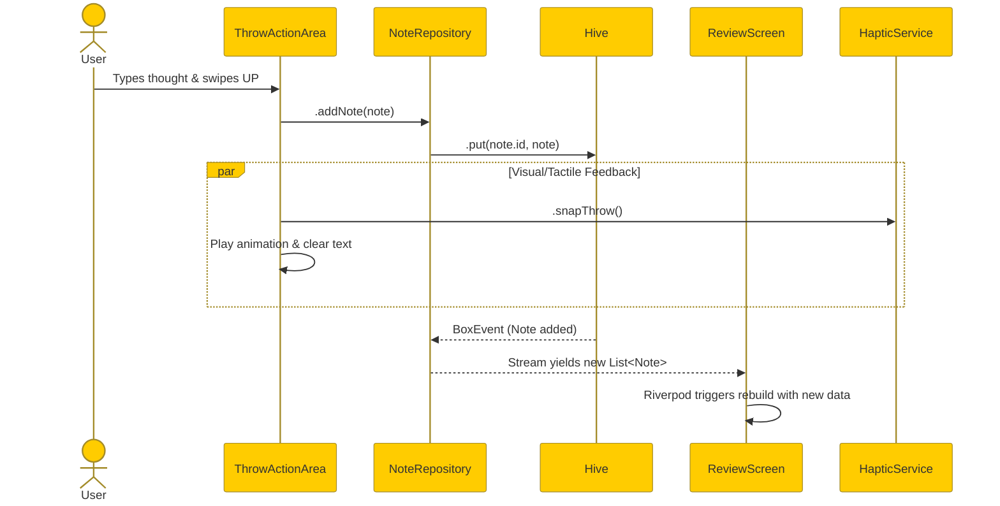
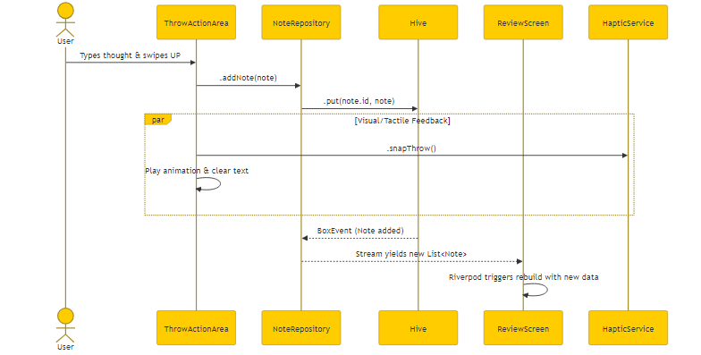

# NoteMeFy Educational Masterclass

## 🧠 Introduction & Tech Stack
NoteMeFy is a specialized "zero-distraction" idea-capture app built in **Flutter**. The primary goal is capturing fleeting thoughts in under 1 second without complex UI getting in the way.

**The Stack**:
*   **Language**: Dart 3 (Strongly typed, asynchronous, null-safe).
*   **Framework**: Flutter (Declarative, cross-platform UI toolkit).
*   **State Management**: `flutter_riverpod` (Compile-safe, reactive dependency injection).
*   **Database**: `hive_flutter` (Lightweight, incredibly fast NoSQL local storage).

---

## 🏗️ Architecture Deep Dive

NoteMeFy uses a Reactive Architecture. Instead of the UI manually asking the database for updates ("Did anything change?"), the Database *pushes* a `Stream` of changes directly to the UI through Riverpod.

### System Diagram

---

## 🌟 Core Concepts & Best Practices

### 1. The Reactive UI Loop (`StreamProvider`)
**What**: Instead of fetching data once, we subscribe to a continuous flow of data using Riverpod's `StreamProvider` linked to a Hive `box.watch()`.
**Why it's best practice**:
*   **No Manual Refreshing**: You never need to call `setState()` or `refresh()` after adding or deleting an item. The UI simply rebuilds automatically.
*   **Single Source of Truth**: The UI always accurately reflects exactly what is on the disk.

*File Reference: `lib/data/repositories/note_repository.dart`.*

### 2. Unidirectional Data Flow
**What**: The `CaptureScreen` does not pass the new note directly to the `ReviewScreen`. It passes it down to the repository.
**Why it's best practice**:
*   Reduces coupling. The screens don't need to know about each other, they only rely on the shared `NoteRepository`.

### 3. Immediate Hardware Feedback (Haptics)
**What**: Using the `haptic_feedback` service *immediately* upon user interaction (like swiping down to "throw" a note).
**Why it's best practice**:
*   In minimalist apps, physical feedback replaces visual clutter (like loading spinners or complex "Success" dialogs).

---

## 🔀 Data Flow Walkthrough

Here is the exact sequence of what happens when a user types an idea and "throws" it.

---

## 💻 Source Code Deep Dive

To see this in action, open the project and look for the `// TUTORIAL:` comments injected throughout the codebase!

*   Start in `lib/data/repositories/note_repository.dart` to see how the `StreamProvider` connects to Hive.
*   Then check `lib/presentation/screens/review_screen.dart` to see how easily Riverpod unpacks the `AsyncValue` (data/loading/error) for a robust UI.
