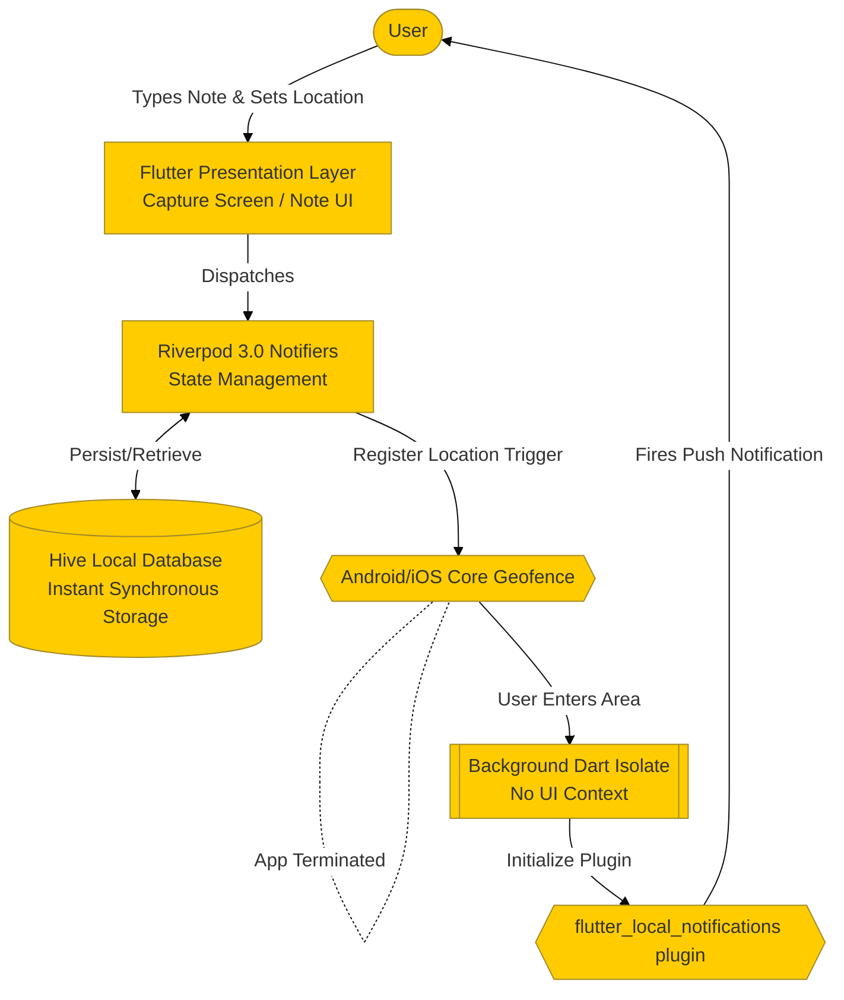
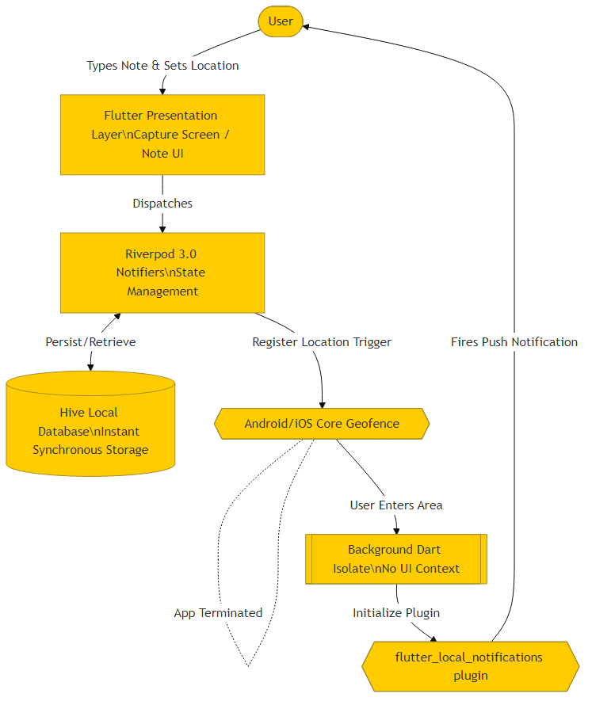

# NoteMeFy Masterclass

## Introduction
Welcome to the NoteMeFy Masterclass! NoteMeFy is a "Zero-UI", context-aware note-taking application designed for rapid capture.

**Why this Stack?**
- **Flutter**: Selected because it natively compiles to ARM code and spins up extremely fast.
- **Riverpod 3.0**: The modern standard for declarative, compile-safe, and reactive state management in Dart.
- **native_geofence & geolocator**: Provides OS-level background hardware interfacing for location-based reminders without heavy battery drain.
- **Hive**: A lightweight, pure-Dart NoSQL database that offers incredible synchronous read/write speeds.

---

## Architecture Deep Dive

NoteMeFy relies on an Event-Driven, Local-First Architecture. Data is persisted instantly, and side-effects (like notifications or location triggers) are registered for background asynchronous execution.





---

## Core Concepts & Best Practices

1. **Zero-UI & Instant Launch (Capture Screen)**
   By auto-focusing the text field synchronously (`autofocus: true`) and storing all data in memory-mapped `Hive` boxes, the keyboard appears instantly (typically <0.5s). See `lib/presentation/screens/capture_screen.dart`.
   *Why it's a best practice:* It respects the user's time and prevents their "spark" of an idea from fading while watching a loading screen.

2. **Isolate-based Background Execution**
   Mobile operating systems will ruthlessly kill apps to save battery.
   *Why it's a best practice:* We offload geofence listeners to a top-level Dart Isolate using `@pragma('vm:entry-point')` (see `lib/services/geofence_service.dart`). This ensures the code always executes, even if the user swipes NoteMeFy away from their multitask recents.

3. **Background Lifecycle Synchronization (Single Source of Truth)**
   OS-level location triggers are entirely decoupled from the Flutter app lifecycle.
   *Why it's a best practice:* We use the local database (Hive) as the absolute single source of truth. Every time the app boots, we pull all running OS geofences and manually diff them against active database notes. This automatically cleans up any "Ghost Geofences" left behind if the app previously crashed.

4. **AMOLED True-Black Theme Optimization**
   Our app features a pure `#000000` AMOLED theme (`Colors.black`) configured in `lib/main.dart`.
   *Why it's a best practice:* For an app that a user might open 30 times a day, lighting up fewer OLED pixels saves meaningful battery life and creates a much more premium look that naturally transitions from the bezel.

---

## Code Walkthrough: Handling the Background

Let's do a literate-programming style breakdown of the core background listener:

```dart
// The @pragma prevents the compiler from optimizing away this function 
// since it's never called explicitly in the Dart code. The OS calls it directly!
@pragma('vm:entry-point')
Future<void> geofenceTriggered(GeofenceCallbackParams params) async {
  
  // 1. Ensure Flutter is ready in the new background isolate.
  WidgetsFlutterBinding.ensureInitialized();

  // 2. Only fire the alarm if the user ENTERED the zone.
  if (params.event == GeofenceEvent.enter) {
    
    // 3. Skip Permission Dialogs
    // The background thread isn't allowed to draw to the screen.
    // 'isBackground: true' stops standard plugins from requesting UI permissions which would crash the app.
    final notificationService = NotificationService();
    await notificationService.init(isBackground: true);

    // 4. Fire the physical notification so the user sees it!
    for (final geofence in params.geofences) {
        /* notification firing logic */
    }
  }
}
```

---

## Source Code Deep Dive
Check out the `// TUTORIAL:` comments injected throughout the codebase to learn more:
- `lib/main.dart` (Hive synchronous load, AMOLED theme)
- `lib/presentation/screens/capture_screen.dart` (Zero-UI autofocus)
- `lib/services/geofence_service.dart` (Background Isolates, State Sync)
