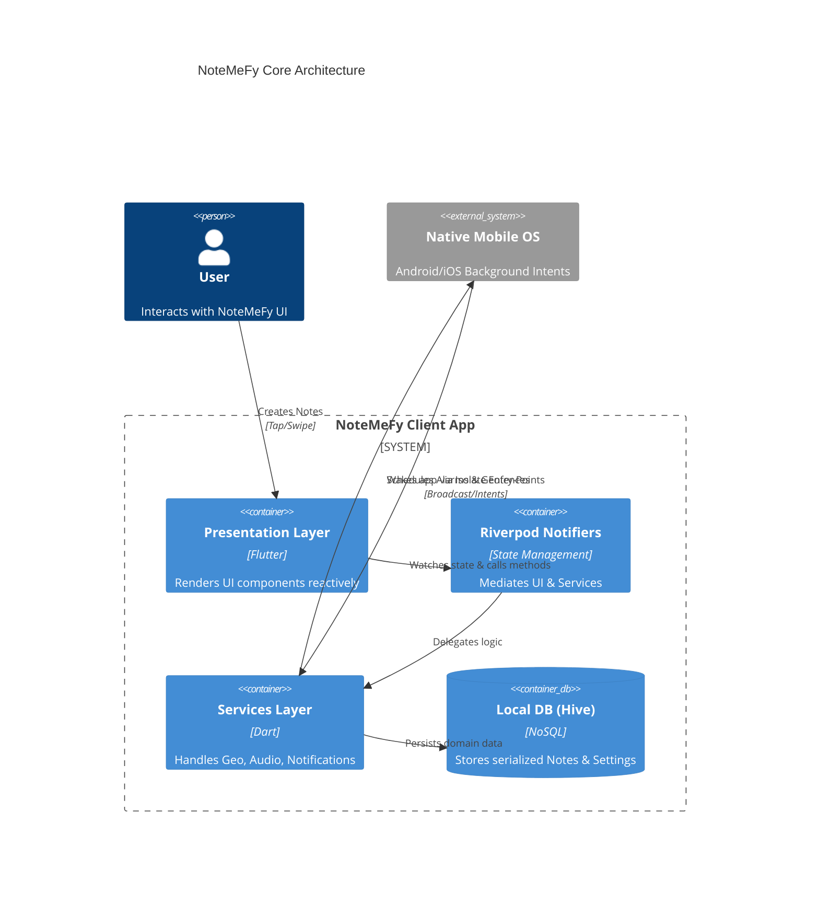
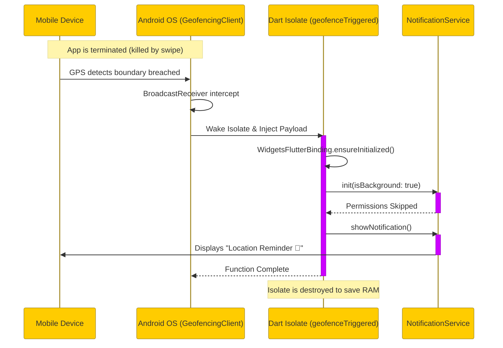

# NoteMeFy Educational Masterclass

Welcome to the **NoteMeFy Masterclass**. This document deeply analyzes the architectural decisions, structural patterns, and core mechanics underlying the application.

## 1. Project Context

NoteMeFy is a mobile application developed utilizing the following stack:
-   **Language:** Dart
-   **Framework:** Flutter (cross-platform deployment)
-   **State Management:** Riverpod 2.0 (`flutter_riverpod`, `hooks_riverpod`)
-   **Local Storage:** Hive (`hive_flutter`), SharedPreferences
-   **Background Processing:** `native_geofence`, `flutter_local_notifications`

The architecture leans towards a **Feature-Driven, Offline-First** design pattern, ensuring that core experiences (capturing ideas) remain instantaneous and uninterrupted by network reliability.

---

## 2. Architecture Deep Dive

The architecture logically separates UI (Presentation Layer) from Business Logic (Services Layer) and Data (Domain/Repository Layer). This ensures testing and state isolation remain robust.


*(The diagram above illustrates the separation of concerns driving NoteMeFy's maintainability).*

---

## 3. Core Concepts & Best Practices Explained

### **Reactive State Management (Riverpod `Notifier`)**
Historically, Flutter apps utilized `setState`, leading to tightly coupled, hard-to-maintain widget logic. NoteMeFy implements **Riverpod** to decentralize logic. 
-   **The Practice:** We define `Notifier` classes that act as a single source of truth for a piece of data (e.g., `TonightTimeNotifier` in `settings_screen.dart`).
-   **Why it's a best practice:** Instead of "pushing" data down a complex widget tree manually, individual widgets simply "listen" (`ref.watch`) to the `Notifier`. When the data changes, only the widgets observing that explicit data rebuild automatically.

### **Headless Background Execution (Isolates)**
A primary feature of NoteMeFy is executing logic (Geofencing) while the app is entirely terminated.
-   **The Practice:** We employ `@pragma('vm:entry-point')` in `geofence_service.dart`. This guarantees that the Dart compiler prevents removing this logic during optimization (tree-shaking).
-   **Why it's a best practice:** Standard background execution methodologies often rely on "Foreground Services," persistently draining battery by keeping an OS wakelock open. Native intents (via `native_geofence`) pass a payload to an isolated segment of memory *only* when the OS-level proximity boundary is crossed.

### **Local-First, Zero-Latency UX (Hive Database)**
-   **The Practice:** NoteMeFy stores captured notes using `Hive`, an incredibly lightweight and fast NoSQL database native to Dart. 
-   **Why it's a best practice:** Modern mobile users abandon applications with perceived latency. By utilizing a synchronous, unencrypted in-memory mapping database initialized instantly on boot (`main.dart`), NoteMeFy guarantees offline availability and rapid read/write cycles compared to traditional SQLite setups.

---

## 4. Code Walkthrough: `NotificationService`

The `NotificationService` is a crucial bridge between Dart Code and OS Native notification channels. Let's examine a critical segment from `notification_service.dart`:

```dart
// TUTORIAL: Initializing safely in background threads
Future<void> init({bool isBackground = false}) async {
  tz.initializeTimeZones(); // Required to calculate correct time offsets locally
  
  // Critical Design Pattern: UI Execution Isolation
  // If `isBackground` is true, the OS isolates the thread completely from the UI.
  // We guard our permission requests because prompting a UI dialog on a background thread
  // causes a fatal crash.
  if (!isBackground) {
    await flutterLocalNotificationsPlugin
        .resolvePlatformSpecificImplementation<AndroidFlutterLocalNotificationsPlugin>()
        ?.requestNotificationsPermission();
  }
}
```

This snippet exemplifies the necessity of understanding **execution contexts**. A developer unaware of background memory environments might assume `init()` is safe anywhere. By explicitly flagging `isBackground`, we decouple setup semantics based on *who* called the function (the UI vs the OS).

---

## 5. Data Flow Sequence: Geofence Trigger Lifecycle

The sequence below details the highly intricate background wakeup lifecycle inside the OS when a user returns Home. Note that the App UI does not need to exist in memory.



---

## Conclusion
NoteMeFy utilizes advanced Flutter architecture to solve robust challenges elegantly. By investigating `// TUTORIAL:` tagged comments across the `lib/services/` and `lib/presentation/` layers, you will acquire a deeper appreciation for modern, performant mobile design!
