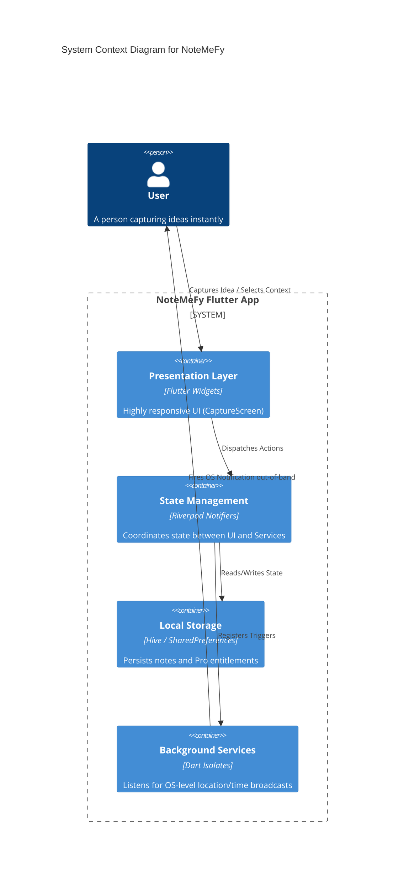
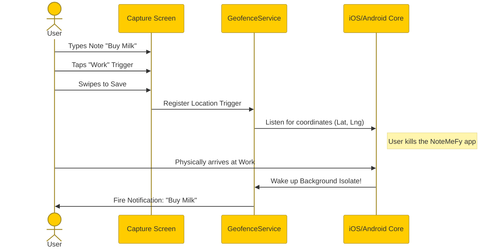

# NoteMeFy Educational Masterclass

## 1. Introduction
Welcome to the NoteMeFy Masterclass! NoteMeFy is a "Zero-UI" context-aware note-taking application designed for rapid capture. 

### Why this Stack?
- **Flutter**: Allows compilation to high-performance native binaries for both iOS and Android from a single codebase.
- **Riverpod 3.0**: The modern standard for declarative, reactive state management.
- **Geofence Service & Geolocator**: Provides OS-level background hardware interfacing for location-based reminders.
- **Hive**: A lightweight, pure-Dart NoSQL database that offers incredible read/write speeds for local-first apps.

---

## 2. Architecture Deep Dive
NoteMeFy relies on an Event-Driven, Local-First Architecture. Data is immediately persisted to the device, and side-effects (like notifications or location triggers) are registered asynchronously.



---

## 3. Core Concepts & Best Practices

### A. Reactive State Management (Riverpod)
Instead of passing data down the widget tree using constructors, we use Provider injection. 
*Why it's a best practice:* It strictly decouples our UI logic from our business logic, making the code vastly more testable and readable.

### B. Isolate-based Background Execution
Mobile operating systems will ruthlessly kill apps to save battery.
*Why it's a best practice:* By offloading our geofence listeners to a top-level Dart Isolate using `@pragma('vm:entry-point')` (see `geofence_service.dart`), we guarantee our location triggers work even when NoteMeFy is swiped away from the recent apps list.

### C. Gated Premium Logic (Client-Side Paywalls)
We intercept premium actions at the Presentation layer (e.g., `smart_trigger_bar.dart`).
*Why it's a best practice:* It creates a frictionless upgrade path without requiring the user to navigate to a dedicated "Settings" menu to upgrade.

### D. Background Lifecycle Synchronization (Single Source of Truth)
OS-level location triggers are entirely decoupled from the Flutter app lifecycle.
*Why it's a best practice:* We use the local database (Hive) as the ultimate single source of truth. Every time the app boots, we pull all running OS geofences (`getRegisteredGeofences()`) and manually diff them against active database notes to eradicate ghost geofences. This guarantees 100% bug-free background execution even after unexpected terminations.

---

## 4. Code Walkthrough: `pro_upgrade_service.dart`
Let's look at how we implemented the modern Riverpod 3.0 state object for the Paywall.

```dart
// 1. We extend Notifier to manage a simple boolean: "is the user Pro?"
class ProStatusNotifier extends Notifier<bool> {
  
  // 2. The `build` method runs when the app starts. It synchronously reads 
  // from our local Hive database to determine the initial state.
  @override
  bool build() {
    final box = Hive.box('settingsBox');
    return box.get('isPro', defaultValue: false);
  }

  // 3. This method is called from the UI when a purchase succeeds.
  // It mutates our state to `true` and saves it permanently to disk.
  Future<void> unlockPro() async {
    // Simulate network delay
    await Future.delayed(const Duration(seconds: 1));
    state = true;
    Hive.box('settingsBox').put('isPro', true);
  }
}
```

---

## 5. Data Flow Sequence
This diagram illustrates the lifecycle of a Context-Aware Note.



## 6. Source Code Deep Dive
Open the following files in your editor to read the injected `// TUTORIAL:` comments:
1. `lib/services/geofence_service.dart` 
2. `lib/services/pro_upgrade_service.dart`
