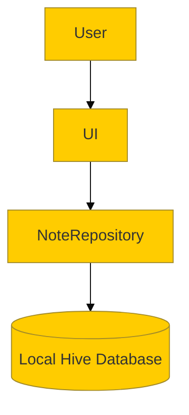

# Project Architecture

## Overview
This document outlines the core architecture of NoteMeFy.

## Example Diagram (following embed-diagrams workflow)

*(To render the above diagram for static viewers, run `npx -y @mermaid-js/mermaid-cli -i architecture.md -o assets/architecture.png -b white` and embed it below)*

